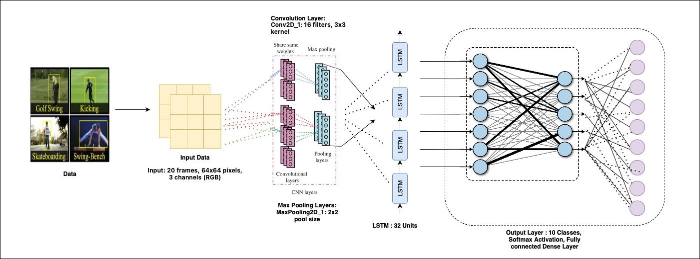
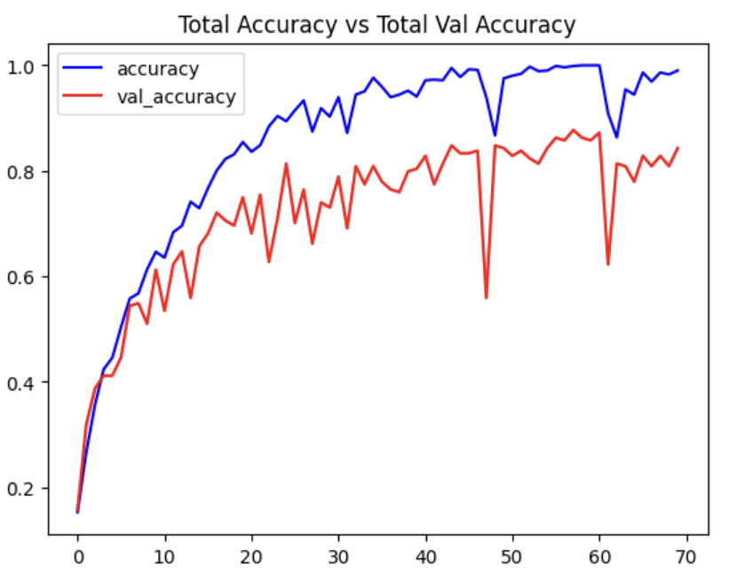
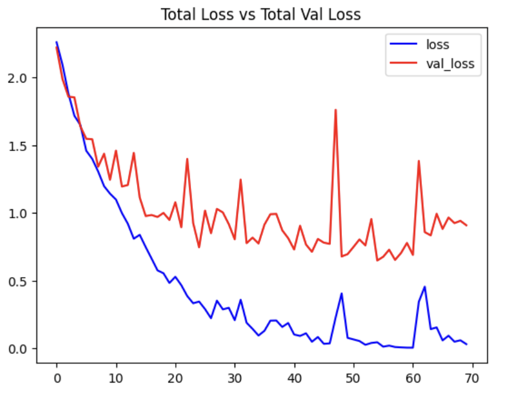

# Human-Activity-Classification

The objective of this project is to develop an automated system for human pose estimation and activity classification in sports and physical activities, aiming to address the limitations of manual annotation and subjective observation. The project seeks to accurately detect and localize key points on the human body, such as joints and limbs, in images, while also classifying different sports movements or physical activities based on the detected poses. Challenges include handling variations in pose, lighting conditions, occlusions, and backgrounds, as well as ensuring real-time processing capabilities and generalization across different sports and activities. By overcoming these challenges, the project aims to provide a reliable and efficient solution with applications in sports analysis, fitness tracking, physical therapy, and human-computer interaction.

# Modeling Approaches:

1. Convolutional Layers: The model starts with a series of time-distributed convolutional layers (`TimeDistributed`) aimed at processing spatiotemporal features. These layers are designed to extract patterns from input data across both spatial (2D) and temporal (time series) dimensions. The first layer has 16 filters with a kernel size of 3x3 applied to input data of size 64x64.

2. Max Pooling Layers: After each pair of convolutional layers, max-pooling layers are applied to reduce the spatial dimensions of the feature maps while retaining the most important information. This helps in capturing the most salient features while reducing computational complexity. Max-pooling layers are applied with a pool size of 2x2.

3. LSTM Layer: Following the convolutional layers, there is an LSTM layer with 32 units. LSTM (Long Short-Term Memory) networks are a type of recurrent neural network (RNN) architecture capable of learning long-term dependencies in sequential data. In this model, the LSTM layer processes the spatiotemporal features extracted by the convolutional layers and captures temporal dependencies in the input sequences.

4. Dense Layer: The final layer of the model is a dense (fully connected) layer with 10 units, followed by a softmax activation function. This layer performs classification based on the features learned by the preceding layers. The output dimensionality of 10 suggests that the model is designed for multi-class classification tasks with 10 classes.

# Model Evaluation:
- The model achieved a loss of 0.7967 and an accuracy of 83.48% on the evaluation dataset.

 

## **Contributors**
- **Project Owner:** Jeeva Saravana Bhavanandam

  

